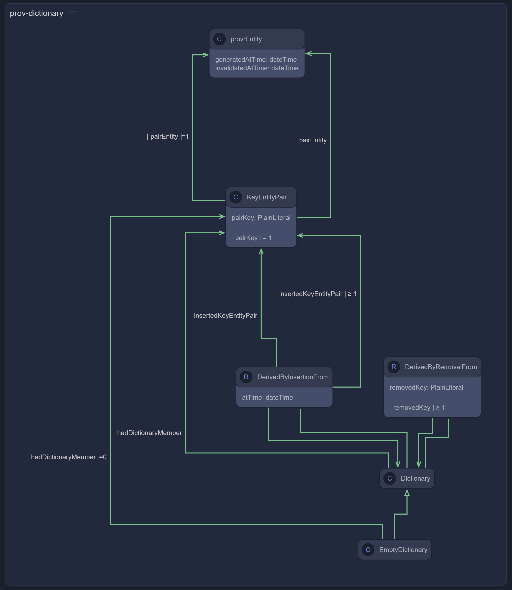

# provenance-vocabularies

## [PROV-O](https://www.w3.org/TR/2013/REC-prov-o-20130430/)

The OML vocabulary uses the OML relation entity reification pattern instead of the RDF qualification pattern.
Surprisingly, the 'Unqualified Influence' properties and 'Qualified Influence' classes listed in 
[Table 2](https://www.w3.org/TR/2013/REC-prov-o-20130430/#qualified-forms-starting-point) and 
[Table 3](https://www.w3.org/TR/2013/REC-prov-o-20130430/#qualified-forms-expanded) correspond 1-1 to, respectively,
the 'forward property' and reified relation class in the OML relation entity reification pattern.


<details>
<summary>Details</summary>

The W3C Prov-O ontology defines binary unqualfied properties (e.g. `prov:wasGeneratedBy`) that can be qualified using a class (e.g. `prov:Generation`).

in OML, the qualfied class (e.g. `prov:Generation`) becomes an OML relation entity class whose 'forward' property corresponds precisely to the Prov-O unqualified property (e.g. `prov:wasGeneratedBy`).

For example:

```oml
	@rdfs:seeAlso "https://www.w3.org/TR/2013/REC-prov-o-20130430/#Generation"
	@rdfs:seeAlso "https://www.w3.org/TR/2013/REC-prov-dm-20130430/Overview.html#term-Generation"
	@rdfs:comment "Generation is the completion of production of a new entity by an activity. This entity did not exist before generation and becomes available for usage after this generation."
	relation entity Generation :> ActivityInfluence, InstantaneousEvent [
		from Entity
		to Activity
		@rdfs:seeAlso "https://www.w3.org/TR/2013/REC-prov-o-20130430/#wasGeneratedBy"
		forward wasGeneratedBy
		@rdfs:seeAlso "https://www.w3.org/TR/2013/REC-prov-o-20130430/#generated"
		reverse generated
		functional
	]
```

In Turtle syntax, the above yields the following, which is logically equivalent to the [Prov-O ontology](https://www.w3.org/ns/prov-o):

```turtle
###  http://www.w3.org/ns/prov#Generation
:Generation rdf:type owl:Class ;
            rdfs:subClassOf :ActivityInfluence ,
                            :InstantaneousEvent ;
            <http://purl.org/dc/elements/1.1/type> <http://opencaesar.io/oml#RelationEntity> ;
            rdfs:comment "Generation is the completion of production of a new entity by an activity. This entity did not exist before generation and becomes available for usage after this generation." ;
            rdfs:seeAlso "https://www.w3.org/TR/2013/REC-prov-dm-20130430/Overview.html#term-Generation" ,
                         "https://www.w3.org/TR/2013/REC-prov-o-20130430/#Generation" .

###  http://www.w3.org/ns/prov#wasGeneratedBy
:wasGeneratedBy rdf:type owl:ObjectProperty ;
                rdfs:subPropertyOf :wasInfluencedByActivity ;
                rdf:type owl:FunctionalProperty ;
                rdfs:domain :Entity ;
                rdfs:range :Activity ;
                <http://purl.org/dc/elements/1.1/type> <http://opencaesar.io/oml#forwardRelation> ;
                rdfs:seeAlso "https://www.w3.org/TR/2013/REC-prov-o-20130430/#wasGeneratedBy" .

###  http://www.w3.org/ns/prov#generated
:generated rdf:type owl:ObjectProperty ;
           owl:inverseOf :wasGeneratedBy ;
           <http://purl.org/dc/elements/1.1/type> <http://opencaesar.io/oml#reverseRelation> ;
           rdfs:seeAlso "https://www.w3.org/TR/2013/REC-prov-o-20130430/#generated" .
```

Most importantly, each OML relation entity has an associated SWRL rule to derive the `forward` property from an instance of the relation entity class.
In this example, the rule derives `prov:wasGeneratedBy` from an instance of `prov:Generation`:

```turtle
[ rdfs:label "wasGeneratedBy derivation" ;
   rdf:type <http://www.w3.org/2003/11/swrl#Imp> ;
   <http://www.w3.org/2003/11/swrl#body> [ rdf:type <http://www.w3.org/2003/11/swrl#AtomList> ;
                                           rdf:first [ rdf:type <http://www.w3.org/2003/11/swrl#IndividualPropertyAtom> ;
                                                       <http://www.w3.org/2003/11/swrl#propertyPredicate> <http://opencaesar.io/oml#hasSource> ;
                                                       <http://www.w3.org/2003/11/swrl#argument1> <urn:swrl#r> ;
                                                       <http://www.w3.org/2003/11/swrl#argument2> <urn:swrl#s>
                                                     ] ;
                                           rdf:rest [ rdf:type <http://www.w3.org/2003/11/swrl#AtomList> ;
                                                      rdf:first [ rdf:type <http://www.w3.org/2003/11/swrl#ClassAtom> ;
                                                                  <http://www.w3.org/2003/11/swrl#classPredicate> :Generation ;
                                                                  <http://www.w3.org/2003/11/swrl#argument1> <urn:swrl#r>
                                                                ] ;
                                                      rdf:rest [ rdf:type <http://www.w3.org/2003/11/swrl#AtomList> ;
                                                                 rdf:first [ rdf:type <http://www.w3.org/2003/11/swrl#IndividualPropertyAtom> ;
                                                                             <http://www.w3.org/2003/11/swrl#propertyPredicate> <http://opencaesar.io/oml#hasTarget> ;
                                                                             <http://www.w3.org/2003/11/swrl#argument1> <urn:swrl#r> ;
                                                                             <http://www.w3.org/2003/11/swrl#argument2> <urn:swrl#t>
                                                                           ] ;
                                                                 rdf:rest rdf:nil
                                                               ]
                                                    ]
                                         ] ;
   <http://www.w3.org/2003/11/swrl#head> [ rdf:type <http://www.w3.org/2003/11/swrl#AtomList> ;
                                           rdf:first [ rdf:type <http://www.w3.org/2003/11/swrl#IndividualPropertyAtom> ;
                                                       <http://www.w3.org/2003/11/swrl#propertyPredicate> :wasGeneratedBy ;
                                                       <http://www.w3.org/2003/11/swrl#argument1> <urn:swrl#s> ;
                                                       <http://www.w3.org/2003/11/swrl#argument2> <urn:swrl#t>
                                                     ] ;
                                           rdf:rest rdf:nil
                                         ]
 ] .
```

In Prov-O, the qualified property is intended to relate an instance of the qualified class.
In OML, this qualified property can be derived via a SWRL rule in OML:

```oml
 	rule qualifiedGeneration_generated [
		Generation(e, g, a) -> qualifiedGeneration(e, g)
	]
```

In Turtle syntax, the above corresponds to the following:

```turtle
[ rdfs:label "qualifiedGeneration_generated" ;
   rdf:type <http://www.w3.org/2003/11/swrl#Imp> ;
   <http://www.w3.org/2003/11/swrl#body> [ rdf:type <http://www.w3.org/2003/11/swrl#AtomList> ;
                                           rdf:first [ rdf:type <http://www.w3.org/2003/11/swrl#ClassAtom> ;
                                                       <http://www.w3.org/2003/11/swrl#classPredicate> :Generation ;
                                                       <http://www.w3.org/2003/11/swrl#argument1> <urn:swrl#g>
                                                     ] ;
                                           rdf:rest [ rdf:type <http://www.w3.org/2003/11/swrl#AtomList> ;
                                                      rdf:first [ rdf:type <http://www.w3.org/2003/11/swrl#IndividualPropertyAtom> ;
                                                                  <http://www.w3.org/2003/11/swrl#propertyPredicate> <http://opencaesar.io/oml#hasSource> ;
                                                                  <http://www.w3.org/2003/11/swrl#argument1> <urn:swrl#g> ;
                                                                  <http://www.w3.org/2003/11/swrl#argument2> <urn:swrl#e>
                                                                ] ;
                                                      rdf:rest [ rdf:type <http://www.w3.org/2003/11/swrl#AtomList> ;
                                                                 rdf:first [ rdf:type <http://www.w3.org/2003/11/swrl#IndividualPropertyAtom> ;
                                                                             <http://www.w3.org/2003/11/swrl#propertyPredicate> <http://opencaesar.io/oml#hasTarget> ;
                                                                             <http://www.w3.org/2003/11/swrl#argument1> <urn:swrl#g> ;
                                                                             <http://www.w3.org/2003/11/swrl#argument2> <urn:swrl#a>
                                                                           ] ;
                                                                 rdf:rest rdf:nil
                                                               ]
                                                    ]
                                         ] ;
   <http://www.w3.org/2003/11/swrl#head> [ rdf:type <http://www.w3.org/2003/11/swrl#AtomList> ;
                                           rdf:first [ rdf:type <http://www.w3.org/2003/11/swrl#IndividualPropertyAtom> ;
                                                       <http://www.w3.org/2003/11/swrl#propertyPredicate> :qualifiedGeneration ;
                                                       <http://www.w3.org/2003/11/swrl#argument1> <urn:swrl#e> ;
                                                       <http://www.w3.org/2003/11/swrl#argument2> <urn:swrl#g>
                                                     ] ;
                                           rdf:rest rdf:nil
                                         ]
 ] .
```

</details>

## [PROV-Dictionary](https://www.w3.org/TR/2013/NOTE-prov-dictionary-20130430/)

Compared with the [prov-dictionary overview](https://www.w3.org/TR/2013/NOTE-prov-dictionary-20130430/#prov-dictionary-owl-terms-at-a-glance), the OML vocabulary uses the OML entity relation pattern instead of the RDF qualification pattern.



<details>
<summary>Details</summary>

Specifically:

- The OML relation entity reification of [prov:derivedByInsertionFrom](https://www.w3.org/TR/2013/NOTE-prov-dictionary-20130430/#derivedByInsertionFrom) 
  combined with the OML relation entity reification of [prov:insertedKeyEntryPair](https://www.w3.org/TR/2013/NOTE-prov-dictionary-20130430/#insertedKeyEntityPair)
  obliviates the need for the original vocabulary: 
  - [prov:dictionary](https://www.w3.org/TR/2013/NOTE-prov-dictionary-20130430/#dictionary); it effectively corresponds to the target of the OML relation entity [prov:derivedByInsertionFrom](https://www.w3.org/TR/2013/NOTE-prov-dictionary-20130430/#derivedByInsertionFrom) or [prov:derivedByRemovalFrom](https://www.w3.org/TR/2013/NOTE-prov-dictionary-20130430/#derivedByRemovalFrom).
  - [prov:Insertion](https://www.w3.org/TR/2013/NOTE-prov-dictionary-20130430/#Insertion); it effectively corresponds to the OML relation entity class reifying [prov:derivedByInsertionFrom](https://www.w3.org/TR/2013/NOTE-prov-dictionary-20130430/#derivedByInsertionFrom).
  - [prov:qualifiedInsertion](https://www.w3.org/TR/2013/NOTE-prov-dictionary-20130430/#qualifiedInsertion); it effectively corresponds to the source and class of the OML relation entity [prov:derivedByInsertionFrom](https://www.w3.org/TR/2013/NOTE-prov-dictionary-20130430/#derivedByInsertionFrom).
  - [prov:Removal](https://www.w3.org/TR/2013/NOTE-prov-dictionary-20130430/#Removal); it effectively corresponds to the OML relation entity class reifying [prov:derivedByRemovalFrom](https://www.w3.org/TR/2013/NOTE-prov-dictionary-20130430/#derivedByRemovalFrom).
  - [prov:qualifiedRemoval](https://www.w3.org/TR/2013/NOTE-prov-dictionary-20130430/#qualifiedRemoval); it effectively corresponds to the source and class of the OML relation entity [prov:derivedByRemovalFrom](https://www.w3.org/TR/2013/NOTE-prov-dictionary-20130430/#derivedByRemovalFrom).

</details>

## Examples

The OML Prov-O vocabulary includes the 11 examples from the specification.

<details>
<summary>Details</summary>

In OML, vocabularies are typically closed before using them for modeling instances in OML descriptions. Closing a vocabulary is a decision made at the level of a group of ontologies, in OML terminology, a vocabulary bundle. This closure applies a policy whereby any pair of classes that have no common specialization are asserted to be disjoint from each other. The resulting set of disjointness axioms computed over the taxonomy of all vocabularies in scope of a vocabulary bundle turns out to be very useful and powerful for OWL2-DL+SWRL reasoners to verify instances in OML description ontologies against the semantics of vocabularies in OML vocabulary bundles.

This technique pointed out problems with the OML Bundle Closure algorithm that generates disjointness constraints that are too strong.
See https://github.com/opencaesar/oml/issues/80


### [Example 4](https://www.w3.org/TR/prov-o/#narrative-example-expanded-3)

This example includes the following axioms:

```turtle
:publicationActivity1124
   a prov:Activity;
   prov:wasAttributedTo :postEditor,
                        :john
.

:john 
   a prov:Person, prov:Agent
.

:postEditor 
   a prov:SoftwareAgent, prov:Agent  ## from Example 1
.   
```

Note that the domain of [prov:wasAttributedTo](https://www.w3.org/TR/2013/REC-prov-o-20130430/#wasAttributedTo) is [prov:Entity](https://www.w3.org/TR/2013/REC-prov-o-20130430/#Entity), not [prov:Activity](https://www.w3.org/TR/2013/REC-prov-o-20130430/#Activity) as used in the example.

Since [prov:Entity](https://www.w3.org/TR/2013/REC-prov-o-20130430/#Entity) and [prov:Activity](https://www.w3.org/TR/2013/REC-prov-o-20130430/#Activity) are disjoint, this example leads to an inconsistency.

Although the OML Provenance ontology does not have disjointness explicitly asserted, with OML bundle closure, this example becomes inconsistent unless the assertions about `:john` and `:postEditor` are removed as is done in the OML [example4.oml](src/examples/oml/example.org/example4.oml).

</details>

## Important note about this repository

This repository depends on the branch `trig-format` of this fork: https://github.com/NicolasRouquette/core-vocabularies
until this PR is merged: https://github.com/opencaesar/core-vocabularies/pull/26

The [build.gradle](build.gradle) is configured to resolve the `core-vocabularies` from https://jitpack.io/#NicolasRouquette/core-vocabularies/